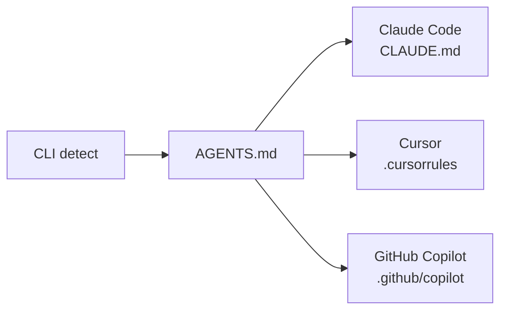
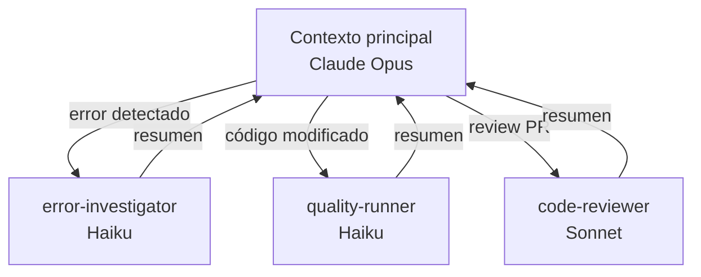
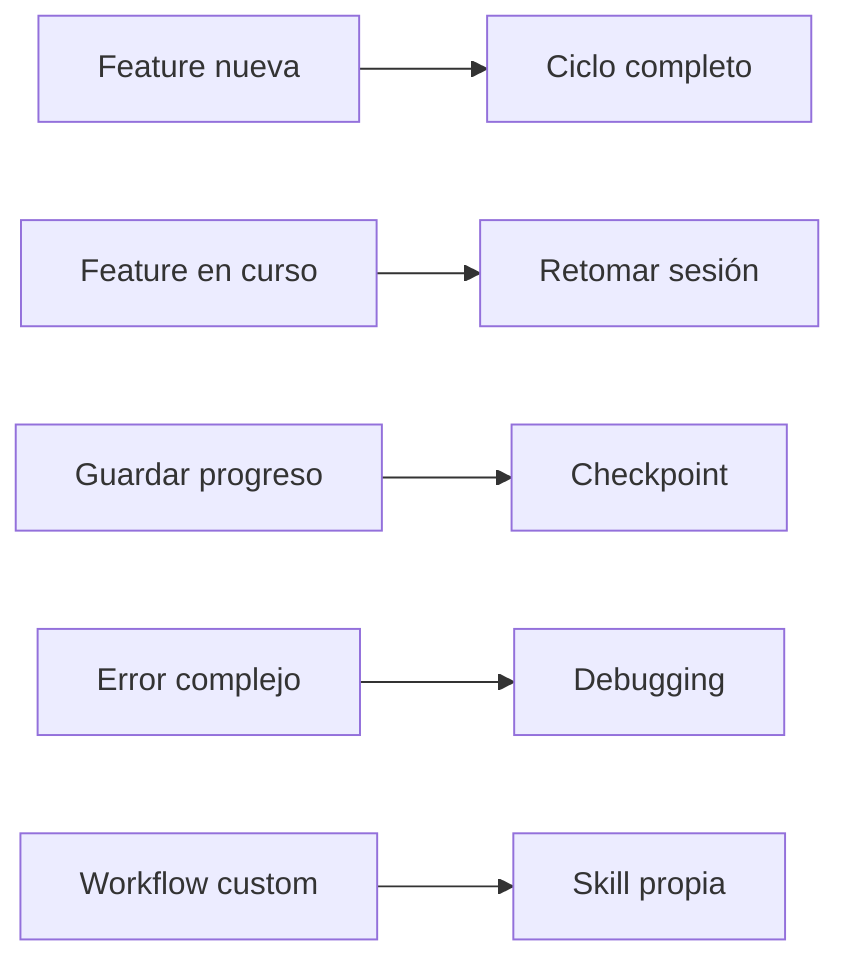
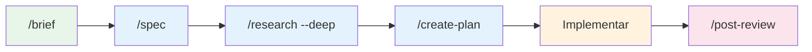
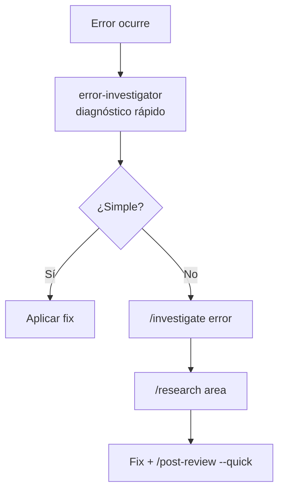
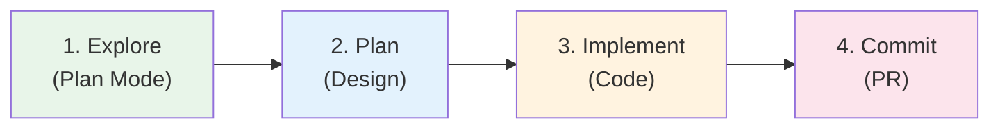
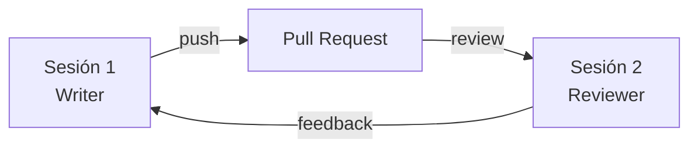
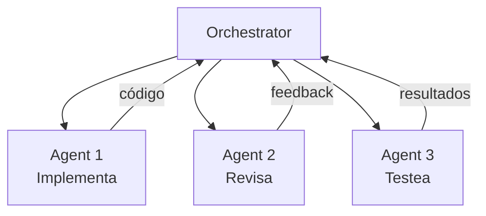

# Workshop 1: rbartronic

> Presentación interna — Equipo de Ingeniería
> `rbartronic` v1.7.1
> Febrero 2026

---

## Tabla de Contenidos

- [Workshop 1: rbartronic](#workshop-1-ai-rbartronic)
  - [Tabla de Contenidos](#tabla-de-contenidos)
  - [1. UVP y Motivación](#1-uvp-y-motivación)
    - [rbartronic — El harness que convierte vibe coding en ingeniería exponencial](#ai-rbartronic--el-harness-que-convierte-vibe-coding-en-ingeniería-exponencial)
  - [2. Características](#2-características)
    - [2.1 Modular](#21-modular)
      - [Skills + Agentes componibles](#skills--agentes-componibles)
    - [2.2 Extensible](#22-extensible)
      - [Skills custom + MCPs](#skills-custom--mcps)
    - [2.3 Alineada con buenas prácticas](#23-alineada-con-buenas-prácticas)
      - [Principios de ingeniería aplicados a IA](#principios-de-ingeniería-aplicados-a-ia)
  - [3. Estructura](#3-estructura)
    - [Visión general del proyecto](#visión-general-del-proyecto)
    - [3.1 AGENTS.md](#31-agentsmd)
      - [El contexto universal](#el-contexto-universal)
    - [3.2 Skills](#32-skills)
      - [Workflows invocables](#workflows-invocables)
    - [3.3 Subagentes](#33-subagentes)
      - [Asistentes automáticos](#asistentes-automáticos)
    - [3.4 Thoughts](#34-thoughts)
      - [Memoria persistente](#memoria-persistente)
    - [3.5 CLI](#35-cli)
      - [Instalación y mantenimiento](#instalación-y-mantenimiento)
  - [4. Instalación](#4-instalación)
    - [4.1 Proyecto nuevo (scaffolding)](#41-proyecto-nuevo-scaffolding)
      - [/scaffold — Proyecto de cero](#scaffold--proyecto-de-cero)
    - [4.2 Proyecto en curso](#42-proyecto-en-curso)
      - [CLI o /setup — Proyecto existente](#cli-o-setup--proyecto-existente)
  - [5. Flujos de trabajo](#5-flujos-de-trabajo)
    - [5.1 Feature de cero](#51-feature-de-cero)
      - [El ciclo completo](#el-ciclo-completo)
    - [5.2 Feature en curso](#52-feature-en-curso)
      - [Retomar feature en curso](#retomar-feature-en-curso)
    - [5.3 Checkpoint](#53-checkpoint)
      - [Guardar progreso](#guardar-progreso)
    - [5.4 Debugging](#54-debugging)
      - [Investigación de errores](#investigación-de-errores)
    - [5.5 Revisar UX (custom)](#55-revisar-ux-custom)
      - [Skill custom de ejemplo](#skill-custom-de-ejemplo)
  - [6. Best Practices (Anthropic)](#6-best-practices-anthropic)
    - [6.1 Verificación](#61-verificación)
      - ["Dale a Claude una forma de verificar su trabajo"](#dale-a-claude-una-forma-de-verificar-su-trabajo)
    - [6.2 Explorar, planificar, codificar](#62-explorar-planificar-codificar)
      - ["Explore first, then plan, then code"](#explore-first-then-plan-then-code)
    - [6.3 Gestionar el contexto](#63-gestionar-el-contexto)
      - ["Gestiona el contexto agresivamente"](#gestiona-el-contexto-agresivamente)
    - [6.4 Sesiones paralelas](#64-sesiones-paralelas)
      - ["El mayor multiplicador de productividad"](#el-mayor-multiplicador-de-productividad)
  - [7. Demo](#7-demo)
    - [Demo en vivo](#demo-en-vivo)
    - [7.1 Feature de cero](#71-feature-de-cero)
      - [Demo — Feature nueva desde cero](#demo--feature-nueva-desde-cero)
    - [7.2 Retomar feature](#72-retomar-feature)
      - [Demo — Retomar feature en curso](#demo--retomar-feature-en-curso)
  - [8. Conclusiones](#8-conclusiones)
  - [9. Siguientes pasos](#9-siguientes-pasos)
    - [9.1 Scaffolding](#91-scaffolding)
      - [Proyecto de cero completo](#proyecto-de-cero-completo)
    - [9.2 Swarms de agentes](#92-swarms-de-agentes)
      - [Agent Teams — Colaboración multi-agente](#agent-teams--colaboración-multi-agente)
    - [9.3 Contexto de 1M tokens](#93-contexto-de-1m-tokens)
      - [1M tokens de contexto — Impacto](#1m-tokens-de-contexto--impacto)
  - [Fuentes](#fuentes)

---

## 1. UVP y Motivación

### rbartronic — El harness que convierte vibe coding en ingeniería exponencial

**El problema**: sin estructura, el desarrollo con IA es caótico.

```
  Coste de un error
  ▲
  │                                          ████ Producción
  │                                     ████
  │                                ████
  │                           ████
  │                      ████
  │              ██ Código
  │         ██
  │    ██
  │ █ Spec/Plan
  └──────────────────────────────────────────────► Fase
    Spec    Plan    Code    Test    Deploy    Prod
```

- Los errores en la fase de **spec/research** son exponencialmente más caros que errores en código
- El **contexto del agente se degrada** con el tiempo (ventana de contexto limitada)
- **Decisiones y aprendizajes se pierden** entre sesiones
- Cada dev tiene un **workflow distinto**, no hay consistencia

|  | 🎸 Vibe coding | 🏗️ Ingeniería exponencial |
|--|----------------|--------------------------|
| **Analogía** | Jam session — improvisas y ves qué sale | Producción musical — hay estructura, tomas y mezcla |
| **Bueno para** | Explorar ideas, prototipos rápidos, hackathons | Features en producción, equipos, proyectos que escalan |
| **Contexto** | Se pierde entre sesiones | Persiste (thoughts/, checkpoints, CLAUDE.md) |
| **Calidad** | Depende de quién promptea | Enforcement automático (rules, agents, quality checks) |
| **Consistencia** | Cada dev improvisa distinto | Workflow compartido (skills + agents) |
| **Conocimiento** | Muere con la sesión | Se acumula y mejora (post-review, learn, CLAUDE.md) |
| **Escala** | 1 dev × 1 sesión | N devs × M sesiones paralelas (worktrees) |

> Vibe coding no es malo — es el punto de partida natural. Pero no escala.

**La solución**: Un harness/framework de ingeniería agéntica/para agentes, modular y extensible que estructura el flujo de desarrollo (spec → plan → implement → review) para maximizar la calidad del output sin perder la velocidad que nos da la IA.

---

## 2. Características

Tres pilares fundamentales:

```
┌──────────────────┐    ┌──────────────────┐    ┌──────────────────┐
│     MODULAR      │    │   EXTENSIBLE     │    │ BUENAS PRÁCTICAS │
│                  │    │                  │    │                  │
│ Skills + Agentes │    │  Skills custom   │    │  DRY, SRP, YAGNI │
│  componibles     │    │  + MCPs          │    │ aplicados a IA   │
└──────────────────┘    └──────────────────┘    └──────────────────┘
```

---

### 2.1 Modular

#### Skills + Agentes componibles

5 bloques independientes agnósticos que puedes usar o no según el proyecto:

```
┌──────────┐  ┌──────────┐  ┌──────────┐  ┌──────────┐  ┌──────────┐
│  Skills  │  │  Agents  │  │  Rules   │  │ Thoughts │  │   CLI    │
│ 14 proc. │  │ 3 helpers│  │  guían   │  │ memoria  │  │ instala  │
└──────────┘  └──────────┘  └──────────┘  └──────────┘  └──────────┘
```

**14 skills** organizadas por fase de desarrollo:

| Fase | Skills |
|------|--------|
| **Orientación** | `/brief`, `/research` |
| **Planificación** | `/spec`, `/create-plan` |
| **Desarrollo** | `/scaffold`, `/setup`, `/investigate`, `/worktree` |
| **Calidad** | `/audit`, `/post-review` |
| **Sesión** | `/checkpoint`, `/backlog`, `/learn`, `/create-skill` |

**3 agentes especializados** que se invocan automáticamente cuando el contexto lo requiere:
- `error-investigator` — diagnóstico rápido de errores
- `code-reviewer` — revisión de PR exhaustiva
- `quality-runner` — typecheck + lint + test tras cada cambio

---

### 2.2 Extensible

#### Skills custom + MCPs

Dos ejes de extensibilidad: **crear tus propios skills** y **conectar herramientas externas**.

**Skills personalizables**: `/create-skill` para crear workflows propios del equipo.

```
/create-skill ux
→ Crea .claude/skills/ux.md
→ Define pasos, herramientas, outputs
→ Listo para usar: /ux [screenshot]
```

**MCPs para desacoplar infraestructura**: Conectar bases de datos, Figma, Slack, sistemas de diseño vía MCP servers.

```
claude mcp add figma        # Analizar mockups
claude mcp add postgres     # Queries directas
claude mcp add slack        # Contexto de conversaciones
```

**Multi-IDE**: Un solo `AGENTS.md` genera configs para múltiples editores.

```
                    AGENTS.md
                       │
          ┌────────────┼────────────┐
          ▼            ▼            ▼
    Claude Code     Cursor     GitHub Copilot
    CLAUDE.md     .cursorrules  .github/copilot
```

**Rules personalizables**: `.claude/rules/` para enforcement de arquitectura y calidad específica del proyecto.

---

### 2.3 Alineada con buenas prácticas

#### Principios de ingeniería aplicados a IA

Las mismas buenas prácticas que usamos en código — **DRY, SRP, YAGNI, Separation of Concerns** — aplicadas al sistema de trabajo con agentes IA:

| Principio | En código | En rbartronic |
|-----------|-----------|------------------------|
| **DRY** | No repetir lógica | Skills reutilizables, no reinventar workflows |
| **SRP** | Una clase, una responsabilidad | Cada skill hace una cosa bien |
| **YAGNI** | No implementar lo que no necesitas | Bloques modulares, activa solo lo que uses |
| **Separation of Concerns** | Capas desacopladas | Rules, Skills, Agents, Thoughts separados |

**Baby Step Principle**: cada tarea deja el codebase funcional.

```
typecheck ✓  →  lint ✓  →  tests ✓  →  commit
```

**Review en el momento más indicado**: revisión humana en spec/plan (donde los errores son baratos), no solo en código.

```
                    COSTE DE CORREGIR
                    ─────────────────
  Spec/Plan  │ █          ← Revisión humana AQUÍ (barato)
  Código     │ ████
  Testing    │ ████████
  Producción │ ████████████████  ← Revisión humana aquí (caro)
```

**CLAUDE.md auto-mejorable**: Claude escribe reglas para sí mismo tras correcciones.

```
Corrección → Claude actualiza CLAUDE.md → Mismo error no se repite
```

**Cost-conscious**: modelos baratos para tareas simples, potentes para complejas.

| Tarea | Modelo | Coste |
|-------|--------|-------|
| Diagnóstico de errores | Haiku | $ |
| Quality checks | Haiku | $ |
| Code review | Sonnet | $$ |
| Implementación | Opus | $$$ |

> **Nota**: esta librería es **agnóstica de Definition of Done (DoD)**. El DoD debe configurarse a nivel de proyecto (en `CLAUDE.md` o `.claude/rules/`), no en la librería. Aquí proveemos la estructura; el equipo define sus criterios de calidad.

---

## 3. Estructura

### Visión general del proyecto

```
proyecto/
  AGENTS.md              ← Contexto universal (multi-IDE)
  CLAUDE.md              ← Reglas auto-mejorables
  .claude/
    skills/              ← 14 workflows invocables
    agents/              ← 3 subagentes especializados
    rules/               ← Enforcement de arquitectura/calidad
  thoughts/              ← Documentos persistentes
  packages/cli/          ← CLI de instalación/actualización
```

---

### 3.1 AGENTS.md

#### El contexto universal

Archivo único que describe: arquitectura, stack, convenciones, workflows.



- Se **genera automáticamente** vía CLI (detecta framework, arquitectura, stack)
- Se puede **regenerar** cuando el stack cambia:
  ```bash
  npx rbartronic regenerate --rules
  ```

**AGENTS.md vs CLAUDE.md**:

| | AGENTS.md | CLAUDE.md |
|---|-----------|-----------|
| **Qué contiene** | Contexto del proyecto | Reglas operativas |
| **Quién lo genera** | CLI (automático) | Claude + humano |
| **Multi-IDE** | Sí | Solo Claude Code |
| **Auto-mejorable** | No (se regenera) | Sí (Claude lo edita) |

---

### 3.2 Skills

#### Workflows invocables

14 skills invocables con `/nombre`. Cada skill es un workflow estructurado paso a paso.

**Dos formatos**:

```
.claude/skills/
  brief.md                    ← Archivo único (simple)
  scaffold/                   ← Directorio (complejo)
    SKILL.md                     Workflow principal
    structures.md                Archivo de soporte
    bootstrap-commands.md        Archivo de soporte
    examples-frontend.md         Archivo de soporte
    ...
```

**Ejemplo rápido** — `/brief authentication`:

```
> /brief authentication

1. Scan docs/       → AGENTS.md, CLAUDE.md, ARCHITECTURE.md
2. Scan código/     → src/**/auth*, login*, session*
3. Scan git/        → Últimos 20 commits relacionados

→ Resumen ejecutivo en ~60 segundos
→ No crea archivos, solo orienta
```

**Crear skills nuevas**:

```
> /create-skill ux

? Nombre: ux
? Descripción: Auditar UX contra checklist
? Herramientas: Read, Glob, Grep
? Invocable por usuario: Sí

→ Genera .claude/skills/ux.md
→ Listo para usar: /ux [screenshot]
```

---

### 3.3 Subagentes

#### Asistentes automáticos

3 agentes que Claude invoca automáticamente según el contexto:

| Agente | Modelo | Cuándo se activa | Output |
|--------|--------|-------------------|--------|
| `error-investigator` | Haiku (barato) | Error, stack trace, test fallido | ERROR → CAUSE → FIX |
| `quality-runner` | Haiku (barato) | Tras cambios de código | typecheck → lint → test |
| `code-reviewer` | Sonnet (potente) | En revisiones de PR | Blocker / Warning / Suggestion |

**Contexto aislado**: los subagentes corren en su propio contexto. No contaminan la conversación principal. Solo devuelven el resumen.



---

### 3.4 Thoughts

#### Memoria persistente

El directorio `thoughts/` almacena todos los artefactos generados por los skills:

```
thoughts/
  specs/              ← PRDs de /spec
  plans/              ← Planes de /create-plan
  context/            ← Contexto adicional
  checkpoints/        ← Snapshots de sesión de /checkpoint
  notes/              ← Lecciones post-PR de /post-review
  debug/              ← Investigaciones de /investigate
  explain/            ← Explicaciones de /learn
  BACKLOG.md          ← Gestión de issues de /backlog
```

**Persiste entre sesiones** — el conocimiento no se pierde.

Se puede referenciar directamente:

```
> Resume from thoughts/checkpoints/2026-02-05_auth.md
> Use the spec at thoughts/specs/payment-flow.md
> Review notes in thoughts/notes/pr-42.md
```

---

### 3.5 CLI

#### Instalación y mantenimiento

```bash
# Instalar en proyecto existente
npx rbartronic init

# Ver qué cambiaría (sin modificar nada)
npx rbartronic init --preview
```

**Detección automática**: framework, arquitectura, stack, scripts, package manager.

**Comandos de mantenimiento**:

| Comando | Descripción |
|---------|-------------|
| `update --check` | Comprueba si hay actualizaciones disponibles |
| `regenerate --rules` | Regenera reglas si cambia el stack |
| `status` | Estado de la instalación y archivos modificados |
| `add [ide]` | Añadir soporte para otro IDE |
| `diff` | Ver diferencias entre local y template |

**Resolución de conflictos**: cuando un archivo ya existe, la CLI pregunta:

```
? .claude/skills/brief.md already exists
  ❯ merge    ← Fusionar cambios inteligentemente
    keep     ← Mantener el tuyo
    replace  ← Reemplazar con el template
```

---

## 4. Instalación

Dos caminos según tu situación:

```
┌─────────────────────┐     ┌─────────────────────┐
│   PROYECTO NUEVO    │     │  PROYECTO EN CURSO   │
│                     │     │                      │
│   /scaffold         │     │  CLI init  o  /setup │
│   (conversacional)  │     │  (automático)        │
└─────────────────────┘     └──────────────────────┘
```

---

### 4.1 Proyecto nuevo (scaffolding)

#### /scaffold — Proyecto de cero

Proceso conversacional guiado:

```
> /scaffold mi-proyecto

? Tipo de proyecto:
  ❯ frontend
    backend
    fullstack
    monorepo

? Framework:
  ❯ Next.js
    React + Vite
    Express
    NestJS

? Arquitectura:
  ❯ Clean Architecture
    DDD
    Feature-based
    MVC

? Stack adicional:
  ☑ Prisma (ORM)
  ☑ Zustand (state)
  ☑ Vitest (testing)
  ☑ Tailwind (UI)
```

**Resultado**: proyecto bootstrapped + `AGENTS.md` + skills + agents + `thoughts/`

> **Status**: WIP (en desarrollo activo)

---

### 4.2 Proyecto en curso

#### CLI o /setup — Proyecto existente

**Opción A** (recomendada) — CLI directo:

```bash
# Ver qué cambiaría
npx rbartronic init --preview

# Aplicar
npx rbartronic init
```

**Opción B** — Skill conversacional:

```
> /setup

Analizando proyecto...
  Framework:     Next.js 15
  Arquitectura:  Feature-based
  Package mgr:   pnpm
  Testing:       Vitest
  Linting:       ESLint + Prettier

? Confirmar configuración detectada? [Y/n]

Instalando...
  ✓ AGENTS.md generado
  ✓ .claude/skills/ (14 skills)
  ✓ .claude/agents/ (3 agentes)
  ✓ .claude/rules/ (2 reglas)
  ✓ thoughts/ (directorio de memoria)

¡Listo! Ejecuta /brief para empezar.
```

---

## 5. Flujos de trabajo

5 flujos principales para cubrir el día a día:



---

### 5.1 Feature de cero

#### El ciclo completo



| Paso | Skill | Qué hace | Output |
|------|-------|----------|--------|
| 1 | `/brief [topic]` | Orientación rápida | Resumen en pantalla (60s) |
| 2 | `/spec [feature]` | Definir requisitos | `thoughts/specs/feature.md` |
| 3 | `/research --deep` | Entender el codebase | `thoughts/context/feature.md` |
| 4 | `/create-plan [feature]` | Diseñar implementación | `thoughts/plans/feature.md` |
| 5 | Implementar | Paso a paso, baby steps | Código + tests |
| 6 | `/post-review` | Verificación de calidad | Notas en `thoughts/notes/` |

**Puntos clave**:
- Cada paso deja el codebase funcional (baby steps)
- La **revisión humana es en spec/plan** (donde es barato corregir)
- Si algo falla en implementación, el plan ya está validado

**Tabla de coste de error por fase**:

| Fase | Coste de corrección | Ejemplo |
|------|---------------------|---------|
| Spec | 1x (minutos) | "No, la auth es con OAuth, no JWT" |
| Plan | 2x (horas) | "Mejor patrón Strategy que if/else" |
| Código | 10x (días) | Refactorizar 15 archivos |
| Producción | 100x (semanas) | Hotfix + rollback + post-mortem |

---

### 5.2 Feature en curso

#### Retomar feature en curso

Escenario: llegas por la mañana, quieres continuar donde lo dejaste.

**El método directo**: leer el último checkpoint.

```
> Lee thoughts/checkpoints/2026-02-05_auth.md y continúa donde lo dejamos

Claude lee el checkpoint y retoma:
  ✓ Contexto del proyecto restaurado
  ✓ 3 de 5 tareas completadas
  ✓ Decisiones previas recordadas
  ✓ Continúa con la tarea 4: validación de tokens
```

El checkpoint contiene todo lo que Claude necesita: qué se hizo, qué falta, decisiones tomadas, archivos modificados. No necesitas explicar nada más.

**Alternativas** si no tienes checkpoint:

```bash
# Retomar última sesión de Claude Code
claude --continue

# Elegir sesión por nombre
claude --resume
```

**Tip**: `/rename auth-refactor` para nombrar sesiones y encontrarlas después.

---

### 5.3 Checkpoint

#### Guardar progreso

`/checkpoint` guarda el estado completo de la sesión:

```
> /checkpoint auth-module

Guardando checkpoint...
  ✓ Qué se ha hecho: 3 de 5 tareas del plan
  ✓ Qué falta: validación de tokens, tests e2e
  ✓ Archivos modificados: 8 archivos
  ✓ Decisiones tomadas: JWT con refresh tokens
  ✓ Guardado en: thoughts/checkpoints/2026-02-06_auth-module.md
```

**Cuándo usarlo**:

| Situación | Por qué |
|-----------|---------|
| Ventana de contexto llena | Empezar sesión fresca con estado |
| Cambiar de tarea | No perder el progreso |
| Fin del día | Continuar mañana |
| Otro dev continúa | Transferir contexto |
| Antes de operación arriesgada | Poder volver atrás |

---

### 5.4 Debugging

#### Investigación de errores

**Automático** — `error-investigator` se activa cuando ocurre un error:

```
$ npm run typecheck
error TS2345: Argument of type 'string' is not assignable...

→ [error-investigator activado automáticamente]
→ ERROR: Type mismatch in UserService.ts:42
→ CAUSE: findById returns User | null, not User
→ FIX: Add null check before accessing properties
```

**Manual** (errores complejos) — `/investigate`:

```
> /investigate "Payment webhook failing silently"

Investigando...
  1. Buscando handlers de webhook...
  2. Analizando logs de Stripe...
  3. Trazando flujo de datos...

Causa raíz: el middleware de verificación de firma
falla silently cuando el secret es de test.

Reporte guardado en: thoughts/debug/payment-webhook.md
```

**Flujo completo**:



---

### 5.5 Revisar UX (custom)

#### Skill custom de ejemplo

Ejemplo real de skill personalizada creada con `/create-skill`:

```
> /ux screenshot.png

Analizando UX...

## Reporte UX — Login Page

### 🔴 Crítico
- [ ] Contraste insuficiente en placeholder text (ratio 2.1:1, mínimo WCAG AA: 4.5:1)
- [ ] Sin indicador de error en campos inválidos

### 🟡 Importante
- [ ] Botón "Submit" no comunica la acción (mejor: "Iniciar sesión")
- [ ] Sin feedback visual al hacer click (loading state)

### 🟢 Nice-to-have
- [ ] Alinear checkbox con baseline del texto
- [ ] Añadir autofocus al primer campo
```

**6 categorías de evaluación**:

| Categoría | Qué revisa |
|-----------|-----------|
| Diseño visual | Jerarquía, contraste, espaciado |
| Interacción | Affordances, estados, feedback |
| Accesibilidad | WCAG AA, focus, semántica |
| Contenido | Textos, labels, mensajes de error |
| Layout | Grid, alineación, responsive |
| Flujo de usuario | Acción primaria, dead-ends |

**Dos modos**: visual (screenshot) y code (análisis estático del markup).

> **Mensaje clave**: la librería se extiende con skills a medida de tu equipo.

---

## 6. Best Practices (Anthropic)

Recomendaciones oficiales de Anthropic para trabajar con Claude Code.

> Fuente: [Best Practices](https://code.claude.com/docs/en/best-practices) + [Common Workflows](https://code.claude.com/docs/en/common-workflows)

---

### 6.1 Verificación

#### "Dale a Claude una forma de verificar su trabajo"

> *"This is the single highest-leverage thing you can do"* — Anthropic

Sin criterios de verificación, **tú eres el único feedback loop**.

| Antes | Después |
|-------|---------|
| "implement email validation" | "write `validateEmail`. test: `user@example.com` = true, `invalid` = false. run tests after" |
| "add a login page" | "add login page. test: renders form, submits credentials, shows error on 401. run `npm test` after" |
| "fix the bug" | "fix the null pointer in `UserService.ts:42`. verify: `npm run typecheck` passes, existing tests green" |

**Siempre incluir**:
- Tests que validen el comportamiento esperado
- Comandos de verificación (`typecheck`, `lint`, `test`)
- Outputs esperados o criterios de aceptación

---

### 6.2 Explorar, planificar, codificar

#### "Explore first, then plan, then code"

Dejar que Claude salte a codificar directamente produce código que **resuelve el problema equivocado**.



| Fase | Qué hace Claude | Skill equivalente |
|------|----------------|-------------------|
| **Explore** | Leer archivos, entender contexto | `/brief`, `/research` |
| **Plan** | Diseñar approach, crear plan detallado | `/spec`, `/create-plan` |
| **Implement** | Codificar contra el plan, con verificación | Implementar + baby steps |
| **Commit** | Commit descriptivo + PR | `/post-review` |

> Esto es exactamente lo que la librería estructura con su workflow recomendado.

---

### 6.3 Gestionar el contexto

#### "Gestiona el contexto agresivamente"

El rendimiento de Claude **degrada cuando la ventana de contexto se llena**.

**Tips**:

| Acción | Cuándo |
|--------|--------|
| `/clear` | Entre tareas no relacionadas |
| Subagentes | Investigación pesada (contexto aislado) |
| `/compact` | Resumir conversación sin perder lo importante |
| `/checkpoint` | Antes de que el contexto se llene |

**Anti-patterns a evitar**:

```
❌ "Kitchen sink session"
   Mezclar tareas no relacionadas en una sesión
   → El contexto se llena de ruido

❌ "CLAUDE.md sobredimensionado"
   Si es muy largo, Claude ignora las reglas
   → Mantenerlo conciso y accionable

❌ "Exploración infinita"
   Investigar sin acotar = contexto lleno sin resultados
   → Acotar con /brief primero, luego /research --deep

❌ "Corrección en bucle"
   Tras 2 correcciones fallidas:
   → /clear + mejor prompt inicial
```

---

### 6.4 Sesiones paralelas

#### "El mayor multiplicador de productividad"

> *"The single biggest productivity unlock"* — Boris Cherny, creador de Claude Code

**Git worktrees**: múltiples branches checkout simultáneamente.

```bash
# Crear worktree para feature A
git worktree add ../project-feature-a -b feature-a
cd ../project-feature-a && claude

# Crear worktree para feature B (en otra terminal)
git worktree add ../project-feature-b -b feature-b
cd ../project-feature-b && claude
```

**3-5 sesiones Claude en paralelo**, cada una en su branch:

```
Terminal 1: feature-a    → /spec → /create-plan → implementar
Terminal 2: feature-b    → /brief → implementar → /post-review
Terminal 3: fix-bug-123  → /investigate → fix → test
```

**Writer/Reviewer pattern**: una sesión escribe, otra revisa (contexto fresco = mejor review).



> La librería incluye `/worktree` para gestionar worktrees fácilmente:
> ```
> /worktree --create feature-a
> /worktree --list
> /worktree --remove feature-a
> ```

---

## 7. Demo

### Demo en vivo

Dos demostraciones del workflow real.

---

### 7.1 Feature de cero

#### Demo — Feature nueva desde cero

**Plan de demo**: ciclo completo en una feature que toque varias capas.

```
1. /brief [feature]           → Orientación rápida
2. /spec [feature]            → Definir requisitos (interactivo)
3. /create-plan               → Plan de implementación
4. Implementar (1-2 pasos)    → Domain → Application → Infrastructure
5. /post-review --quick       → Verificación automática
```

**Qué observar durante la demo**:
- Cómo `/brief` escanea el codebase en paralelo
- Cómo `/spec` hace preguntas antes de escribir
- Cómo el plan respeta Clean Architecture (capas)
- Cómo `quality-runner` valida automáticamente tras cada cambio
- Cómo `/post-review` verifica el resultado final

---

### 7.2 Retomar feature

#### Demo — Retomar feature en curso

```
1. claude --resume            → Mostrar picker de sesiones
2. Seleccionar sesión         → Ver cómo carga el contexto
3. Continuar implementando    → El agente sabe dónde quedamos
4. /checkpoint                → Guardar progreso para mañana
```

**Qué observar durante la demo**:
- Cómo `--resume` lista sesiones anteriores con nombres
- Cómo el checkpoint restaura decisiones y progreso
- Cómo `/checkpoint` genera un archivo legible en `thoughts/`

---

## 8. Conclusiones

```
┌─────────────────────────────────────────────────────────────┐
│                                                             │
│  Vibe coding es improvisar.                                 │
│  Esto es ingeniería exponencial.                            │
│                                                             │
└─────────────────────────────────────────────────────────────┘
```

La diferencia entre "pedirle cosas a la IA" y **estructurar la colaboración con IA** es la misma que entre improvisar y hacer ingeniería. La estructura no limita — **multiplica**.

**6 ideas clave**:

1. **Invertir en spec/plan** ahorra órdenes de magnitud en rework
2. **El conocimiento persiste** entre sesiones (`thoughts/`, `CLAUDE.md`)
3. **El sistema se auto-mejora** con el uso (reglas, skills, notas)
4. **La estructura es extensible** y adaptable a cada equipo
5. **Las sesiones paralelas** son el mayor multiplicador de productividad
6. **El diseño importa más que nunca** — cuando el desarrollo se acelera exponencialmente, un mal diseño se propaga exponencialmente

**Sobre diseño y calidad**:

El desarrollo exponencial no elimina la necesidad de diseño — la amplifica. Si la dirección es incorrecta, llegas más rápido al sitio equivocado. Por eso:

- **Diseño funcional, UX y UI de calidad** son prerequisitos, no extras. Un buen diseño es el mapa que evita que la velocidad se convierta en caos.
- **QA es más crítico que nunca**. Más velocidad de desarrollo = más superficie de error potencial. Las regresiones no se evitan yendo despacio, sino con estructura (tests, rules, quality checks automáticos).
- El desarrollo exponencial no es para hacer lo mismo más rápido — es para **ser ambiciosos**. Para construir aplicaciones y servicios no del pasado, sino de un presente que ya es futuro.

---

## 9. Siguientes pasos

Tres líneas de evolución para la librería.

---

### 9.1 Scaffolding

#### Proyecto de cero completo

`/scaffold` todavía en WIP. Objetivo: bootstrapear proyectos completos con arquitectura + configs + skills en un solo comando.

```
/scaffold mi-app --type fullstack --framework nextjs --arch clean

→ Proyecto completo generado:
  ✓ Estructura de carpetas (Clean Architecture)
  ✓ Configs (ESLint, Prettier, TypeScript, Vitest)
  ✓ AGENTS.md + skills + agents + rules
  ✓ CI/CD pipeline
  ✓ README con instrucciones
```

**Soporte planificado**: frontend, backend, fullstack, monorepo.

---

### 9.2 Swarms de agentes

#### Agent Teams — Colaboración multi-agente

Anthropic ha lanzado "agent teams" (research preview, febrero 2026): múltiples agentes coordinados con tareas compartidas y mensajería.



**Posibilidades**:
- Un agente implementa, otro revisa, otro testea — en paralelo
- Coordinación automática sin intervención humana
- Escalado horizontal de tareas de desarrollo

> Explorar cómo integrar esto en los workflows de la librería.

---

### 9.3 Contexto de 1M tokens

#### 1M tokens de contexto — Impacto

Opus 4.6 soporta **1M de tokens de entrada** (beta).

**Impacto**:
- Codebases enteros en contexto, menos necesidad de chunking
- Specs, plans, y código fuente juntos en una sola sesión

**Pero**: más contexto != mejor rendimiento.

```
Rendimiento
▲
│  ████
│  ████████
│  ████████████
│  ████████████████
│  ████████████████████
│  █████████████████████████
│  █████████████████████████░░░░░░  ← degradación
│  █████████████████████████░░░░░░░░░░░░
└──────────────────────────────────────────► Tokens usados
   10K    50K   100K   200K   500K    1M
```

La gestión del contexto sigue siendo clave. Explorar cómo ajustar los workflows para aprovechar ventanas más grandes sin degradar calidad.

---

## Fuentes

- [Best Practices for Claude Code](https://code.claude.com/docs/en/best-practices) — Anthropic official docs
- [Common Workflows](https://code.claude.com/docs/en/common-workflows) — Anthropic official docs
- [How Anthropic teams use Claude Code](https://www-cdn.anthropic.com/58284b19e702b49db9302d5b6f135ad8871e7658.pdf) — Anthropic PDF
- Codebase: `rbartronic` v1.7.1
